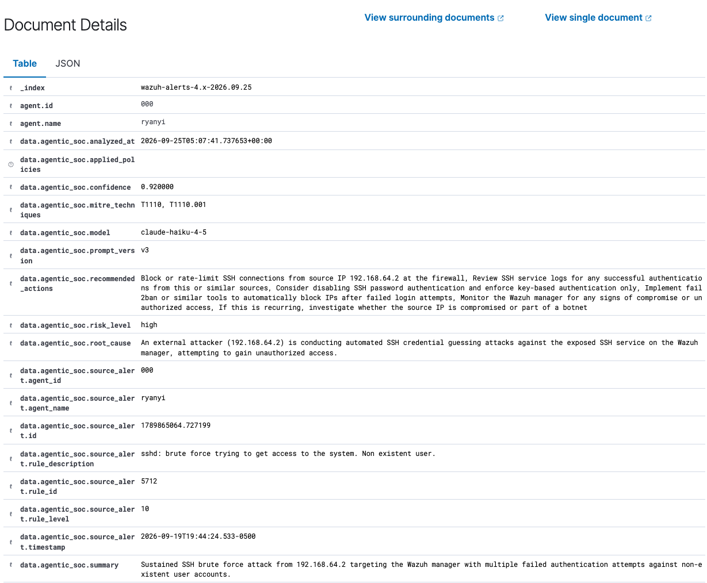
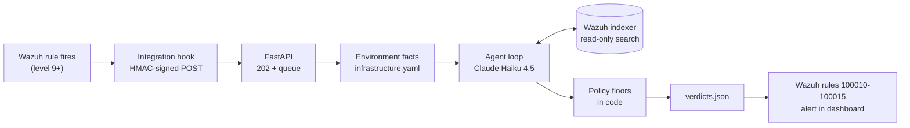

# Agentic SOC Analyst for Wazuh

[](https://github.com/ryanyi2/wazuh-agentic-soc/actions/workflows/ci.yml)

An LLM agent that triages [Wazuh](https://wazuh.com) SIEM alerts. For each
high-severity alert it searches the alert history with read-only tools, decides
how serious the alert is, and writes its verdict back into Wazuh as a native
alert, next to the alert it analysed.

Security teams drown in alerts, and most of them are noise. This service acts
as a first-line analyst: it clears the alerts it can explain, escalates the
ones it cannot, and says why.



*An agent verdict as a native alert in the Wazuh dashboard.*

## Results

Measured on a held-out set of 14 real alerts from the lab, never used for
tuning, with each alert analysed 3 times (42 analyses):

| Metric | Result |
|---|---|
| Missed threats | **0** of 18 attack analyses |
| Precision when clearing an alert | **1.00** (19 of 19 cleared alerts were benign) |
| Benign alerts cleared | **79%** (19 of 24) |
| Cost per alert | **$0.005** (Claude Haiku 4.5, about 3,000 input tokens) |
| Mean analysis time | 5.5 s |

The set is small and lab-sized: all six attacks are SSH brute force. The full
write-up in [evals/RESULTS.md](evals/RESULTS.md) covers the development-set
experiments, an adversarial test against the admin account, a look-ahead bug
found in the evaluation harness, and the cases the agent still gets wrong.

## How it works



1. A Wazuh rule at level 9 or above fires. Wazuh's integration daemon runs the
   hook in `wazuh/integrations/`, which signs the alert with HMAC-SHA256, posts
   it to the service and exits.
2. The API checks the signature, returns `202 Accepted` at once, and queues the
   alert for a background worker.
3. The worker selects the facts about the environment that are relevant to
   this alert (who the admins are, which networks are trusted, what each host
   is) from `context/infrastructure.yaml`.
4. The agent reads the alert and those facts, searches the alert history
   (by source IP, host and time window), and answers with a structured verdict:
   risk level, confidence, summary, root cause, MITRE ATT&CK techniques and
   recommended actions.
5. Code-enforced policies can raise the verdict's risk level, never lower it.
6. The verdict is appended to a JSON-lines log. Wazuh reads that log, and
   custom rules turn each verdict into a native alert at a level that matches
   its risk (false positive 3, low 5, medium 8, high 12, critical 14).

## Design decisions

**Fire-and-forget ingestion.** Wazuh's integration daemon times out after about
10 seconds and then retries. An analysis takes around 5 seconds and is allowed
up to 60, so the hook hands the alert off and exits, and all analysis happens
asynchronously. Waiting would cause timeouts, duplicate deliveries and dropped
alerts under load.

**Read-only by construction.** The indexer client has exactly one request: a
search against `wazuh-alerts-*`. There is no method that writes, updates or
deletes, and a test enforces it. The worst outcome of a wrong verdict is a
wrong opinion, never a blocked user or a deleted file.

**Bounded agent loop.** At most 8 tool calls and 60 seconds per alert. The
model can only call registered tools, and tool errors are fed back to it
rather than crashing the loop. If the loop runs out of budget or the answer
cannot be parsed, the alert is escalated to medium for a human. A failed
analysis never clears an alert.

**Policy in code, judgment in the model.** Some rules must hold whatever the
model says: a correlated brute-force alert is never rated below high, a
successful login from an untrusted network is always reviewed, and failed
logins to an admin account from an untrusted source are at least medium. These
floors run after the model answers and can only raise a verdict. A missing
source IP counts as untrusted (fail closed). The model cannot claim that a
policy fired; only code records that.

**Alert content is untrusted input.** Usernames, log lines and other alert
fields are chosen by whoever generated the traffic, possibly the attacker. They
go into a fenced `<untrusted_alert_data>` block with angle brackets escaped, so
they cannot close the fence or forge the trusted `<environment_context>` block
that holds the defenders' facts.

**The model controls what to search, not when.** The search window ends at the
alert's own timestamp, set by code rather than by a model argument. Replayed
alerts therefore cannot see events that happened after they fired. This was a
real bug found during evaluation; fixing it raised the benign clearance rate on
the held-out set from 58% to 79% (details in RESULTS.md).

**Verdicts become native Wazuh alerts.** Writing verdicts through a log file
and custom rules means they get Wazuh's existing dashboard, search and
alerting. High and critical verdicts are level 12 and 14, above the level-9
forwarding threshold, so they would be sent back for analysis. Both the hook
and the API drop anything in the `agentic_soc` rule group, which breaks that
loop in two independent places.

**Measured, not assumed.** Current Claude models do not accept a temperature
setting, so every evaluation runs each case several times and reports the
spread. Token usage is metered on every call. Prompt caching was evaluated and
not used: Claude Haiku 4.5 only caches prompt prefixes of at least 4,096
tokens, and a whole request here averages under 3,000.

**Least privilege at the OS level too.** The systemd unit makes the filesystem
read-only for the service, apart from its verdict log directory and a private
`/tmp`. The container image runs as a non-root user, and secrets are passed at
run time, never built into the image.

## Limits

- The evaluation is lab-scale: 14 held-out alerts, and SSH brute force is the
  only attack type run in the lab.
- The agent has one tool, alert-history search. It cannot verify file hashes,
  check threat intelligence or inspect a host, so it escalates alerts such as
  rootcheck's "trojaned binary" that it cannot verify.
- The admin-account policy has a known cost: a local password typo with no
  source IP is raised to medium.
- Verdicts vary between runs. Results are reported over repeated runs for
  that reason.

## Running it

Requirements: a Wazuh manager with its indexer, Python 3.11 or later, and an
Anthropic API key. Developed on a home lab: an Ubuntu VM running the Wazuh
manager, indexer and dashboard, with a Kali Linux VM enrolled as an agent and
used as the attacker.

```bash
git clone https://github.com/ryanyi2/wazuh-agentic-soc
cd wazuh-agentic-soc
python3 -m venv .venv && source .venv/bin/activate
pip install -e ".[dev]"
cp .env.example .env    # set the HMAC secret, API key and indexer credentials
sudo mkdir -p /var/log/agentic-soc && sudo chown "$USER" /var/log/agentic-soc
```

Wazuh side (hook, integration block, verdict rules and log reader):
see [wazuh/README.md](wazuh/README.md). Describe your own environment in
`context/infrastructure.yaml`.

Run the service in one of three ways:

- **systemd:** `deploy/agentic-soc.service` (install steps in the file)
- **Docker:** see the header of the `Dockerfile`
- **By hand:** `uvicorn agentic_soc.api:app --host 127.0.0.1 --port 8080`

Checks and evaluation:

```bash
ruff check . && mypy src && pytest                      # offline, no API key needed
python evals/run_eval.py evals/holdout.jsonl --repeat 3  # live: calls Claude and the indexer
```

## Repository layout

## Tech

Python, FastAPI, Pydantic, httpx, Anthropic API (Claude Haiku 4.5), Wazuh,
OpenSearch, MITRE ATT&CK, systemd, Docker, GitHub Actions.

## License

MIT. See [LICENSE](LICENSE).
